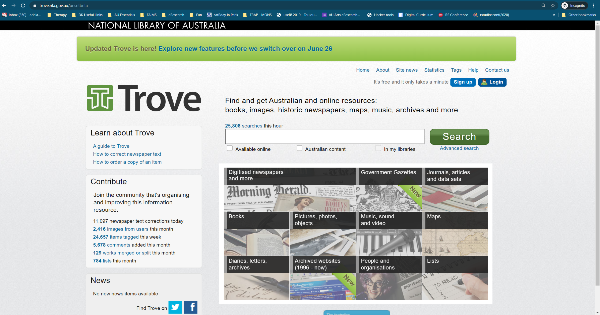
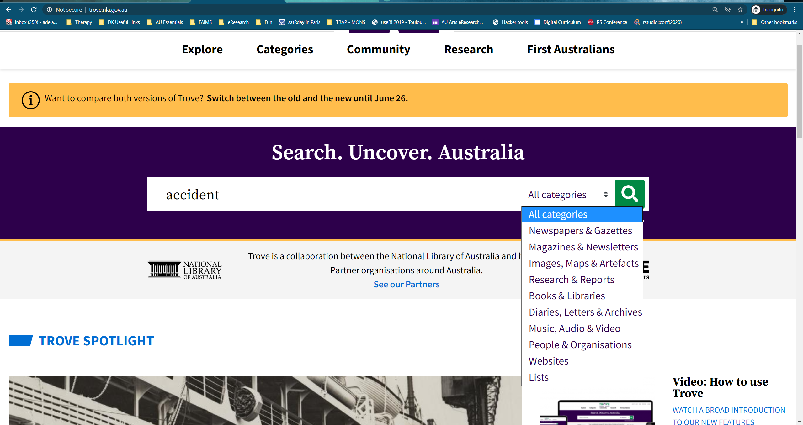

```{r setup, include=FALSE}
knitr::opts_chunk$set(echo = TRUE)
```

## Introduction


### What is this exercise about?  
- This exercise is about digital collections of cultural heritage and the techniques we use to create, describe, manage, use, and explore their content.
- The focus is on the intellectual, rather than physical, control. So not how we store things, but how we develop systems and standards to describe them.
- We will also be exploring the role of descriptive systems in supporting the discovery and use of collections. What can we do with them, particularly in the digital realm?

### What is expected of you?
- Read and follow this tutorial, ask questions, and ask for help.
- Complete the steps below and the set of activities and post the answers in your [GoogleFolder](https://drive.google.com/drive/folders/1opasmsd5ak6YlYXn0L0_h08Z3zUO_A2J) or in Zoom/Mentimeter polls.


## Collectors and collections
### Introducing Trove
Let is start our exploration by looking at Trove, the principal public digital collection of Australia.

Why? Trove is one of the most modern and multi-faceted national digital archives out there in the world. It is a collection of collections, as it brings together the holdings of hundreds of organisations, from local historical societies to national institutions. It is a useful place to get an overview of Australias cultural heritage collections. But don`t be fooled into thinking that Trove includes everything! 

### Let us try a simple search:

Go to www.trove.nla.gov.au

Beware that in June 2020, Trove went through a major website makeover. The old interface of Trove contained a grid of object zones that you could use to refine results to specific categories of artefacts. 



In the new interface, you need to use the category drop down next to the Search box or a category band across the top of the page.  





- Look around the page. What sorts of things are in Trove? How many resources are currently included? 
- Type `danish immigrant` (without the quotes) in the search box and click `Search`.
- Find the `Images, maps, artefacts` category or results box and click on it to focus on results from the Trove pictures zone. 
- Let us refine our results using facets. Under `Refine your results` on the right hand side, click `Artefact` under Format. What happens?
- Look through your results of artefacts for a danish immigrant. How many can you find? Where do they [the records] come from?
- Click on the title of an object to view more details. Now click on the `View at…` link below the thumbnail – Trove will send you to the website of the organisation that holds the object (if it is free access).

<font color="blue">
Task 1. Write out brief answers to these questions (you can use a document in your GDrive) and be ready to discuss:

1) how many resources are there in Trove?
2) what is a `facet` and how does it differ from a Search box?
3) are individual records stored in Trove? If not, then where?
</font color>

### Disasters and accidents

Let us say you are concerned about the effects of industrialisation on public health and wish to know the trends in accidents over the last 150 years, through time and space in Australia. 

Start a new search on www.trove.nla.gov.au

- Type `accident` (without the quotes) in the search box and click `Search`.
- Find the `Newspapers and Gazettes` category and click on it to focus on results from the Trove newspapers zone. 
- Let us refine our results using facets. Under `Refine your results` on the right hand side or the bottom of the page, click `Date range`. What happens? Click `Show more` at the bottom.
- Look through your results for accidents reported in newspapers. How many can you find? Where do they [the records] come from?
- What decade sees the most accidents reported in Australia?
- How does the trend change in New South Wales versus Victoria?

<font color="blue">
Task 2. Write out answers to these questions. 

1) Which decade sees the most accidents reported in newspapers in Australia?
2) Does Victoria or New South Wales have more accidents reported in this period? 
3) What is the trend in accidents in the 2000s?
</font>


### Are we all curators now?
Trove brings together cultural heritage collections, but it does more. It is a place where individuals can create and contribute their own collections. For example, anyone can add their photos to Trove, simply by sharing them with the Australia in Pictures group on Flickr.

Do you share photos, links, or posts online? Do you create your own collections using tools such as Pinterest or Tumblr? The development of social media and a range of digital collecting tools has made it easier for us to find, organise and share things that are of interest to us.

Along the way, however, the word `curator` has taken a bit of a battering. Log in into Vimeo to watch this [video](https://vimeo.com/87716505) and if you can access it, read this short article, [`All curators now`](https://www.1843magazine.com/content/ideas/anthony-gardner/all-curators-now):
As you can see, using Trove you explore collections all around Australia. For more search hints see the Trove help documentation.

<font color="blue">
Task 3: Consult your group and produce an answer in GDrive

Is there a difference between the sort of collecting that an individual undertakes and what happens in a museum or archive? What is that difference?
</font color>


This is a question you may return to in the assignments in this class. Authority and control matter; who chooses what is kept and why? Investigate how collection items can be embedded within systems that document their context and relationships. What gives an object its meaning, significance, and authenticity?

Using Trove, people can assemble their own collections, reflecting their interests, and serving the needs of their own communities.

Let us look at some examples:

[Tags](https://trove.nla.gov.au/help/become-voluntrove/tags) are keywords anyone can add to items in Trove to make them easier to find. You may see tags in a Trove work or item record. Often a group of enthusiasts have agreed to use a particular tag, something like a [controlled vocabulary](http://www.getty.edu/research/publications/electronic_publications/intro_controlled_vocab/what.pdf) to bring together resources that are of interest to them.

[Lists](https://trove.nla.gov.au/help/become-voluntrove/lists) are another way that Trove users can create their own collections. They are simply groups of resources on a particular topic. Here is a short [video](https://youtu.be/lcHL1EDtNlE) for Trove volunteers describing how to use them:

## OPTIONAL: Making your own Trove collection
Following the instructions in the [VolunTrove](https://trove.nla.gov.au/help/become-voluntrove), try creating your own list.

Before you start adding items, you will need to set up your own Trove account:

- Click on the `Sign up` button, and follow the instructions. You will receive an email to verify your registration.
- Once your account is verified, you might need to click on the `Login` button and enter your details.
- You are welcome to create a list on any topic that interests you. If inspiration fails, how about choosing a random example and documenting the amazing history of butter in Australia?

Here are the requirements for your list:

- Add at least 10 items.
- Include at least 2 photos, 2 objects, and 2 newspaper articles.
- Use items with thumbnail images if possible.
- Once you are done, go to your list (you can always find your own lists by looking under your User Profile). Click on the `List options` link on the top right of your list and see if you can work out how to select a representative image for your list.

Once you are done, share a link to your list on GDrive.

## From collection to exhibition (Also optional)

Trove lists are handy, but they don`t look very pretty. There is a way of taking the content of a list (or  a series of lists) and turning them into a simple online exhibition.

Here is an exhibition about [The Chinese in NSW](http://baibi.github.io/chinese-in-nsw-in-pictures/#/) by Kate Bagnall that pulls together content from 10 different lists. Each list provides a different exhibition theme or topic.

It is easy to turn your list into an exhibition, just follow [these instructions](https://github.com/wragge/diy-trove-exhibition). Have a go and share the results on GDrive.

Not only is this a nicer way of presenting the contents of your lists, it is an example of what becomes possible once we share collection data online. We can not only search it, we can build new things with it. 


<font color="purple">
This tutorial was adapted from Tim Sherratt. Original content on this site is licensed under a Creative Commons Attribution 4.0 International License.
</font>