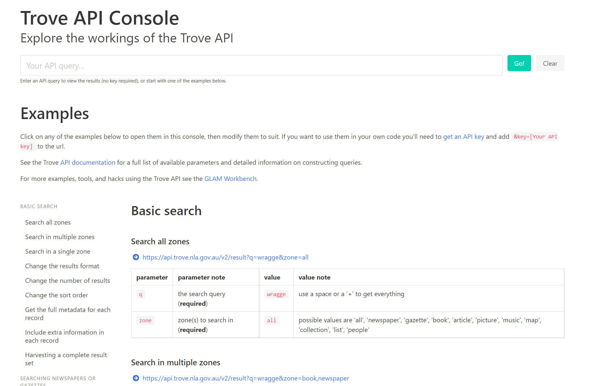
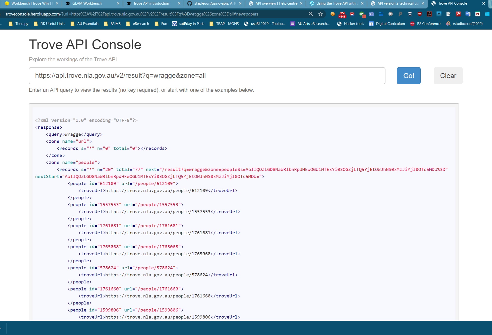
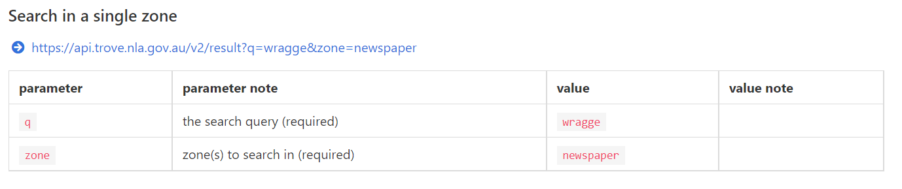
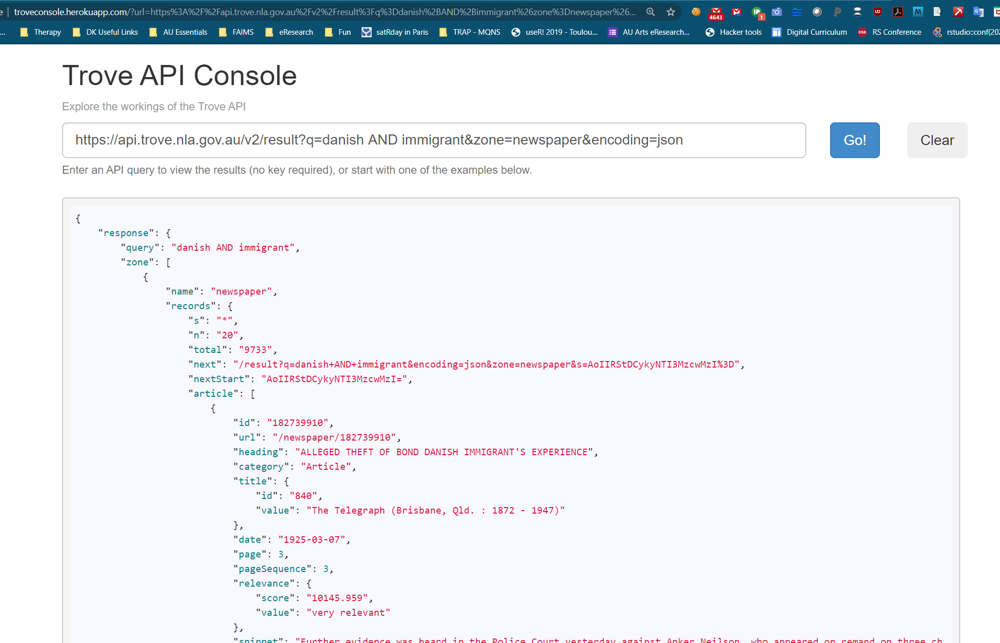

```{r setup, include=FALSE}
knitr::opts_chunk$set(echo = TRUE)
```

## Introduction to APIs

Your internet experience runs on APIs. The functionality behind this acronym has helped you compare the best prices for flights or electric appliances, and allows you to embed a map into your website or seamlessly process your credit card payments.

But what is an API and why does it matter to you as a researcher? Here is we’ll give a high-level overview of APIs and how they relate to your daily life as well as research career.

### What is an API?
API stands for *application programming interface*. This is a concept in software technology that essentially refers to how multiple applications can interact with and obtain data from one another. APIs operate on an agreement of inputs and outputs.

**Application**: These can be apps that you use on your smartphone such as maps, house-searching or hotel-booking apps.

**Programming**: Set of communication rules which allow applications to access data.

**Interface**: How you as a user interact with the application.

### How do APIs Work: An Analogy
To use an analogy here, we’ll compare basic search via interface (which you used in the last session) with APIs to the difference between ordering a la carte in a Bulgarian restaurant versus talking to a bartender in Sydney.

Example 1: In a Bulgarian restaurant you’re given a menu with a list of drinks and meals. Seeing these, you assume that there is an existing convention you can follow (i.e., the menu) to state your order and obtain a drink. You also assume that if items are listed they are actually available. Yet, the reality of Bulgaria is that ingredients are seasonal while menus are rarely updated, and so you will frequently hear: 'We don't have that' or 'not in season' until you work your way to the available items.

To translate this into computing language: The menu as it is presented to you is the search interface. The restaurant has agreed to serve the listed drinks and meals. Should you pick something that is not in season, you'll be told "sorry". Should you ask for something that is not specified in the menu, e.g. can you have the filled peppers dish served without the ground meat in a vegetarian fashion?, the restaurant can say 'no', because it’s not something they agreed to in the menu. And then there is the issue of stuff not being in stock. Well, sometimes, interfaces too are imperfect, out of date or misleading/obscure.

Example 2: In a bar in Sydney, there is a menu of drinks and bites available for you to order from. It is, however, also possible for you to go directly to the bar, review the stock on the wall and order what you feel like regardless of whether it is on the menu or not. You may just say 'I feel like apples and ginger today' and the bartender will shake it up for you on demand (true story, happenned to Adela in the 'Spice Bar' on the Martin Square).

Using an API is like walking up to the bar in Sydney; it provides you with direct access to the entire bar's contents. You are skipping the interface and looking directly into the available ingredients and building your custom order of vodka apple-ginger martini.

**Take away point: using an API is like walking into a self-serve bar where you can recombine ingredients to create endless cocktail concoctions. Cultural heritage collections which give users direct access to their data via APIs, make data retrieval, exchange, and mashing possibilities limitless**

Let’s stretch the second example a bit further. Let's say covid lockdown is back and you want that vodka apple-ginger martini delivered to your home. You call a delivery service and you order a vodka apple-ginger martini by selecting from the basic alcohol & ingredients list, skipping the cocktails menu. When you order it, someone will tell the bartender your order, the bartender will make the vodka apple-ginger martini and then someone will deliver it to your home. This is an example of an additional service (delivery) built on an “API” (building an order from the basic ingredient menu).

To relate this back to software, an API can help one application retrieve specific types of data from another application. 


### Three Things You Should Know About APIs
To recap, here are three takeaways for APIs.

1. Regular users of the internet rarely directly interact with APIs but they consume the products of APIs (e.g. aggregated air travel websites where you can choose the cheapest fare). Developers work with APIs to create software. Researchers and research institutions can use APIs to access and aggregate data. 
2. APIs operate as a gate, allowing informed users to share select information but also keeping unwanted requests out.
3. APIs can make your [digital historian] life easier, too. When thousands of records in a digital archive are accessible via an API, you can download them with a single request rather than by paging through the resources, clicking and downloading each individually and manually.

## Let's practice..


We shall practice on Trove, the National Library of Australia’s “discovery interface”. As you found out in the previous sessions, Trove is an amazing catalogue of digitized books, newspapers, maps, music, journal articles etc.  Trove provides access to much of its data through an API. The API is a special website that programs can talk to to run queries, retrieve individual records, etc. With some creative ideas and the [Trove API Console](http://troveconsole.herokuapp.com/) instructions, you can make a pretty nifty tool for yourself, or even win a [Digital Humanities award](https://glam-workbench.net/awards/#british-library-lab-awards-2020).


You will now learn to use the API to harvest data and analyse the contents of Trove. 


Our practice will be small-scale. We will learn to construct an API query by using the Trove API Console. You only need internet and a browser and a bit of brainpower for this.


### Trove API Console
An easy way to start exploring the API is by using the [Trove API Console](http://troveconsole.herokuapp.com/). The Console lets you construct queries and view snippets of live results in your browser. This way you learn how the API syntax works. 
In order to do *real* archival work and download large amounts of records to your computer, you will need to include an API key in your queries. An API key is a special identifier that you need to apply for and use with care, once you are confident in your API syntax. Guidelines for API keys are provided at the end of this tutorial. 

Once you understand the basics you'll probably want to dive into the [complete technical guide](https://trove.nla.gov.au/about/create-something/using-api/api-technical-guide) which lists all the available parameters and response formats.

Let's navigate to [Trove API Console](http://troveconsole.herokuapp.com/). Please beware that the actual interface might look somewhat different than the screenshots below due to continued UI changes:


1. You should see a search bar and examples below.



2. Look at the first example of a query and try to decipher what the different parts of the https://... address mean. These are the query "parameters".  

Let's unpack the query, now. As you read along the https://.., you see that it points to a web address of the Trove API, version2. Then follows the word "result?", after which comes the query itself. The first element is "q", which stands for the query pointing to a search term. In this case, "wragge" is a common Australian last name. "zone" is a category of evidence where the search is running, such as 'newspapers', or 'books'. In this case, we are looking for all mentions of the last name 'Wragge' everywhere in Trove. Optional parameters can be added, such as 'n' to specify what number of records you wish to be shown, and 'encoding' which specifies the format that Trove should return. You have two options of xml (default) and json.

3. Next, copy the URL, and paste it into the Search box at the top of the page. Press Go! button.

After a flick of couple seconds, you should get something looking like this, with 77 total records and 20 of them shown, with ids of the individuals in nested format below. 


4. Click 'Clear' and look at some other examples. Below 'Search all zones' section, is the 'Search in multiple zones' and 'Search in a single zone' section. 
Let's use the 'Search in a single zone' to look for danish immigrant stories in newspapers!



Step 1. Copy the first query under 'Search in a single zone'. It looks something like https://api.trove.nla.gov.au/v2/result?q=wragge&zone=newspaper designed to look for the term "wragge" in newspapers with no limit on number of records. 

Expanding this to 
https://api.trove.nla.gov.au/v2/result?q=wragge+AND+weather&zone=newspaper
would change the query to search for terms "wragge" and "weather"

5. Paste it into the Search box above and replace 'wragge' with 'danish' , and 'weather' with 'immigrant'. 

```{r}
# https://api.trove.nla.gov.au/v2/result?q=danish+AND+immigrant&zone=newspaper&encoding=json
```

Leave no spaces anywhere. Press Go! button. 

6. You should now see the output. (If you don't see anything, scroll up to the Search bar)
How many results are there?


<font color = "blue">
Task 1. Now that you see how the Trove Console works, construct a query to interrogate the total number of newspaper articles that mention accidents in the two decades of 1900-1909, and 1910-1919.


Task 2. Review individual results in your group and then post the two queries (URLs) plus the screenshots in your group GoogleDoc
</font>

## APIs in the real world.

You might have noticed that the API queries are shaped as URLs, same as the addresses that appear in your internet browser. That is exactly what APIs are, and to use the API query to its fullest potential you can paste the query that you have successfully tested into the browser address bar. Don't do it just yet, though.

In order to do this, namely to use API at large scale, you need to obtain an API key. Trove is protecting itself again unwanted attacks by requiring API users to register so that each query has an identified users. 

Obtaining an API key is free and quick. Eventually, if you want to go all the way, you need to follow these [instructions](https://help.nla.gov.au/trove/building-with-trove/api).
:)
This is the end of this exercise. You know enough about APIs now to be ready to explore and harness them with programming tools - perhaps in the theory-oriented methods course on Digital Methods for Historians :).  