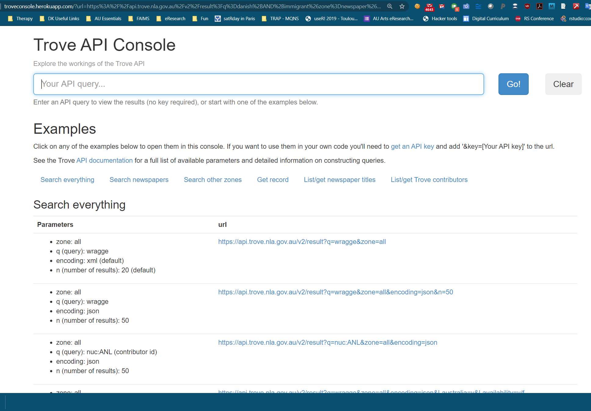
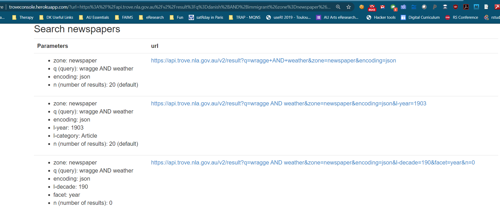

```{r setup, include=FALSE}
knitr::opts_chunk$set(echo = TRUE)
```

## Introduction to APIs

Your Internet experience runs on APIs. The acronym has helped you compare the best prices for flights, allowed you to embed a map into your store’s website and seamlessly processed your credit card payments.

But what is an API and why does it matter to you? In this article, we’ll give a high-level overview of APIs and how they relate to your daily life.

### What is an API?
API stands for application programming interface. This is a concept in software technology that essentially refers to how multiple applications can interact with and obtain data from one another. APIs operate on an agreement of inputs and outputs.

**Application**: These can be apps that you use on your smartphone or a software program that you use.
**Programming**: Developers use APIs to write software.
**Interface**: How you interact with the application.

### How do APIs Work: An Analogy
To use an analogy here, we’ll compare this to ordering from a menu in Bulgaria versus talking to the bartender in Sydney.

Example 1: In a restaurant in Bulgaria, you’re given a menu with several drinks and meals listed. Seeing these, you assume that there is an existing convention you can follow (i.e., the menu) to state your order and obtain a drink. Yet, Bulgaria is a developing country, and available ingredients vary through the year while menus don't, and so you will frequently hear: 'We don't have that' or 'not in season' until you work your way to the actual items in stock.

To translate this into computing language: The menu as it’s presented to you is the search interface. In this case, the interface is imperfect and works only part of the year for certain ingredients. All the drinks and meals listed on the menu are what the restaurant has agreed to serve. When you ask for a certain drink on the menu, you receive it if it is in stock. If you ask for something that is in stock but off the menu, such as the mint growing in the garden or vodka martini instead of a gin martini, the restaurant need not provide it because it’s not something they agreed to serve.

Example 2: In a bar in Sydney, there is also a menu of drinks and ord'euvres available for you to order from. But it is also possible for you to go directly to the bar, review the stock and order a concoction you feel like regardless of whether it is on the menu or not. The bartender will be happy to make it.

In this case, going to the bar provides you with direct access to the bar's contents. You are skipping the interface and looking directly into the list of available ingredients and building your custom order of vodka martini.

**Take away point: using an API is like walking into a self-serve bar where you can recombine ingredients to create endless coctail concoctions. Cultural heritage collections which give users direct access to their data via APIs, make data retrieval, exchange and combination possibilities limitless**

Let’s stretch the second example a bit further. Let's say you want that vodka martini delivered to your home. You call a delivery service and you order a vodka martini by selecting from the basic alcohol list, skipping the coctails menu. When you order it, someone will tell the bartender your order, the bartender will make the vodka martini and then someone will deliver it to your home. This is an example of an additional service (delivery) built on an “API” (building an order from the basic ingredient menu).

To relate this back to software, an API can help one application retrieve specific types of data from another. If the API doesn’t support certain types of data, it won’t be able to facilitate the retrieval of that “off-menu” data.


###5 Things You Should Know About APIs
To recap, here are the five takeaways for APIs.

1. Developers work with APIs to create software and apps. It’s rare for you, the end user, to directly interact with an API.
2. APIs operate as a gate, allowing companies to share select information but also keeping unwanted requests out.
3. APIs can make your life run a little smoother. When airlines share data about flights and prices, travel aggregating sites can compile them all and help you compare.
4. Businesses are built on APIs. 
5. If you’re using a third-party app to manage your social media, it might not be the app’s fault that a feature isn’t being offered. It’s more likely that the network doesn’t have it as part of their API.

## Let's practice..

We shall practice on Trove, the National Library of Australia’s “discovery interface”. As you found out in the previous sessions, Trove is an amazing catalogue of books, newspapers, maps, music, journal articles etc.  Trove provides access to much of its data through an API (Application Programming Interface). The API is a special website that programs can talk to run queries, retrieve individual records etc. With some creative ideas and a bit of coding skill, you could make a pretty nifty tool and win a digital humanities award.


You will now learn to use the API to harvest data and analyse the contents of Trove. 


Our practice will be small-scale. We will learn to construct an API query by using the Trove API Console. You only need internet and a browser and a bit of brainpower for this.


### Trove API Console
An easy way to start exploring the API is by using the [Trove API Console](http://troveconsole.herokuapp.com/). The Console lets you construct queries and view live results in your browser, without having to worry about an API key. Once you understand the basics you'll probably want to dive into the [complete technical guide](https://help.nla.gov.au/trove/building-with-trove/api-version-2-technical-guide) which lists all the available parameters and response formats.

Let's navigate to [Trove API Console](http://troveconsole.herokuapp.com/)
1. You should see a search bar and examples below.



2. Look at the first example and try to decipher what the Parameters mean.  Wragge is an Australian surname, n is a number of records you will be shown, and encoding is the format that Trove will return.

4. Then copy the url, and paste it into the Search box above. Press Go! button.

After a flick of couple seconds, you should get something looking like this


3. Click clear and look at some other examples. Below 'Search Everything' section, is the 'Search Newspapers' section. 
Let's search newspapers for our danish immigrant stories!



4. Copy the first query under 'Search Newspapers'. It looks something like https://api.trove.nla.gov.au/v2/result?q=wragge+AND+weather&zone=newspaper&encoding=json desiged to look for the terms wragge (a placename) and weather, in newspapers with no limit on number of records. 

5. Paste it into the Search box above and replace 'wragge' with 'danish' , and 'weather' with 'immigrant'. 

```{r}
# https://api.trove.nla.gov.au/v2/result?q=danish+AND+immigrant&zone=newspaper&encoding=json
```

Leave no spaces anywhere. Press Go! button. 

6. You should now see the output. (If you don't see anything, scroll up to the Search bar)
How many results are there?


<font color = "blue">
Task 1. Now that you see how the Trove Console works, construct a query to interrogate the total number of newspaper articles that mention accidents in the two decades of 1900-1909, and 1910-1919.
Task 2. Review individual results in your group and then post the two queries plus the screenshots in your group GoogleDoc
</font>

## APIs in the real world.

You might have noticed that the API queries are shaped as URLs, same as the addresses that appear in your internet browser. That is exactly what APIs are, and to use the API query to its fullest potential you can paste the query that you have successfuly tested into the browser address bar. Don't do it just yet, though.

In order to do this, namely to use API at large scale, you need to obtain an API key. Trove is protecting itself again unwanted attacks by requiring API users to register so that each query has an identified users. 

Obtaining an API key is free and quick. Eventually, if you want to go all the way, you need to follow these [instructions](https://help.nla.gov.au/trove/building-with-trove/api).