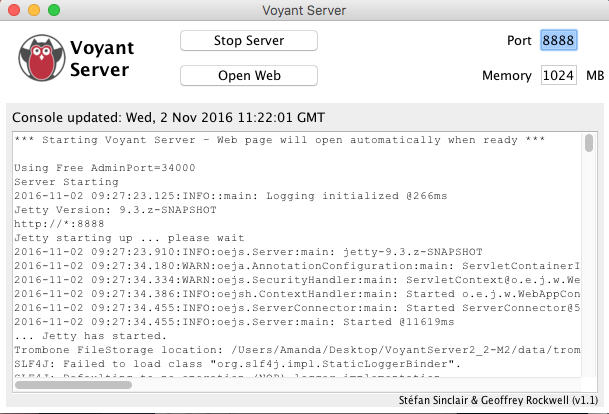

# Getting Started

In order to fully participate in workshops on Thursday and Friday in week 36, you need to have downloaded *Stadsarkivet data* from the class shared drive (only reachable via eduroam on campus), and the *Voyant server* desktop software. Both downloads will take time, so allow plenty and if in difficulty, sign up for a slot with assistant by Monday 5 pm, on week 36. 

## Software and Data needed

Read here about the software and go into the Installation section to install and configure it. 

- [JAVA](https://www.java.com/en/): Before downloading Voyant, you will need to download Java if you don’t already have it. If you do have Java installed, you should still download and update your version.  

- [VOYANT](http://docs.voyant-tools.org/resources/run-your-own/voyant-server/#download): This is a rather large download [~450Mb], requiring solid internet connection. If you can’t get it to download, assistants will have copies available on flash drives.

- DATA (on Shared drive:ARTS_DigitalArchives2019): This dataset has been digitized and curated for this class by the Aarhus Stadtsarkivet. It contains the entirety of the minutes filed during 1939-1945. Please, get on  eduroam or, if working from home, on [VPN](https://medarbejdere.au.dk/administration/it/vejledninger/netvaerk/vpn/) and [shared drive instructions](https://medarbejdere.au.dk/administration/it/vejledninger/dataopbevaring/tilgaa-delt-folder/) to download all of the datasets on your computer. The data is NOT in public domain *yet* and under no conditions should you circulate or disseminate it online, or outside the present class. If you violate this rule, you will be liable for breaching the copyright law in Denmark. 

## Installation

Although Voyant Tools is a web based set of tools, we’ll be downloading it and running it locally. Downloading Voyant to your own computer brings a number of advantages but the main impetus for doing so today is so that we won’t encounter loading issues resulting from overwhelming the server. However using Voyant locally also means that your texts won’t be cached and stored on the Voyant Server, it allows you to restart the server if you encounter problems, and it allows you to work offline, without an internet connection.

1. [Install or Update Java](https://www.java.com/en/)

2. Download Voyant Server from [Github](https://github.com/sgsinclair/VoyantServer/releases/tag/2.4.0-M45) (If the download doesn’t work for you, sign up for assistant session, they will have the file on a flash drive)

3. Unzip the Voyant Server Package (you may need an unzipping software/extractor. [7zip](https://www.7-zip.org/) is a free open-source tool for Windows users). The resulting folder of files should look like this on a Mac and Windows:

[comment]:#

4. Double click the VoyantServer.jar file. When you open this file a new window (see image below) will pop up with numerous server controls. If you’re curious about what these all mean you can read about the options in the documentation for the Voyant Server. However, in short, this window begins to launch a server which will generate the Voyant tools interface.

5. Once the server has booted up a new browser window will open.

{#id .class width=80%}

** If your default browser is Chrome you’ll need to paste the address into a new window in a different browser. Both Safari and Firefox work. The default address should be: 
http://127.0.0.1:8888/

# Using Voyant

## Uploading Data to Voyant
Voyant offers several ways to upload text. You can upload individual text files from your computer, paste lines into the box provided, or upload a zip file/archive that contains many files. Once you’ve downloaded the zip file of data we can simply upload it to Voyant. To upload the file:

- Select Upload from the Voyant Tools Homepage

{#id .class width=80%}

- Navigate to the location where the file is saved on your computer. (Likely the downloads folder).

- Once you’ve selected the file, click 'Open' and Voyant will upload the file and direct you to the dashboard. This may take a few seconds to a few minutes depending on your computer's performance and the memory you allocated to Voyant (and the size of the corpus of documents). 

Exploring the “Default Skin”
After uploading the corpus, you will be redirected to what Voyant calls the “default skin”, or, the default configuration of tools. To understand the many options, tools, and settings available and necessary to process  Danish texts in Voyant see Adela's slides[link needed] and [Voyant documentation](http://voyant-tools.org/docs/#!/guide).

# Managing text and visualisations in Voyant

We will cover these topics in the hands-on session in week 36. 

- stopword lists for non-default languages (e.g. Danish)
- searching concepts in Voyant
- exporting visualisations and frequency data from Voyant

The following sections serve as a guide to some of the computational analyses you can on texts, and as illustration of the scholarly work that involved text analysis. Finally, there is a glossary of terms you might encounter during this course.

# Text Analysis

“Text Analysis” is a broad category that describes a number of specific methodologies that have been adapted from the fields of computer science and linguistics and used for humanistic inquiry.The overall goal, is to turn text into data for analysis.

Some of the most popular forms of text analysis include:

[N-Grams](https://en.wikipedia.org/wiki/N-gram)

[Topic Modeling](https://en.wikipedia.org/wiki/Topic_model)

[Sentiment Analysis](https://en.wikipedia.org/wiki/Sentiment_analysis)

[Named Entity Recognition](https://en.wikipedia.org/wiki/Named-entity_recognition)

[Word Embedded Vector Models](https://en.wikipedia.org/wiki/Vector_space_model)

## Examples of Scholarly Projects Using Text Analysis

[Mining the Dispatch](http://dsl.richmond.edu/dispatch/), Robert K. Nelson

[Mining Martha Ballard’s Diary](http://www.cameronblevins.org/martha-ballards-diary/), Cameron Blevins

[America’s Public Bible](https://americaspublicbible.org/), Lincoln Mullen

[“Everything on Paper will Be Used Against Me:” Quantifying Kissenger](https://blog.quantifyingkissinger.com/), Micki Kauffman

[Robots Reading Vogue](http://bookworm.library.yale.edu/), Lindsay King and Peter Leonard

# Other datasets for practice

[SPEECHES OF VACLAV HAVEL](https://bit.ly/HavelSpeeches): This is a corpus on English translations of the speeches given by Vaclav Havel to nurture civil society during his presidency of the CSFR and Czech Republic from 1990 - 2003. Selected from the Prague Castle Web Archive at http://old.hrad.cz/president/Havel/index_uk.html  

[SAMPLE POLITICAL SPEECHES](https://bit.ly/VoyantPoliticalSpeeches): This corpus contains a sample of political speech transcripts from Australian prime ministers, Donald Trump and Vladimir Putin under Creative Commons 3.0 and 4.0 license. 

[PE SAMPLE DATA](https://github.com/regan008/MindandBodyCorpus): This sample data has been curated from a larger corpus. It contains the entirety of the physical education publication Mind and Body which ran from 1882 until 1936.

# Glossary
- Black Box: A device, system or object which can be viewed in terms of its inputs and outputs without any knowledge of its internal workings. In Digital Humanities, projects and tools are often critiqued for being “black boxes” which prevent scholars from studying and analyzing the methodological choices made when composing the project.
- Collocation: a sequence of words or terms that co-occur more often than would be expected by chance.
- Corpus: a collection of documents.
- Optical Character Recognition (OCR): Software that turns images of text into machine readable plain text documents.
- Reproducible Research: This term originates from fields such as computer science or engineering that rely on computers to generate scholarly work. It refers to the idea that the ultimate product of academic research is the paper along with the full computational environment used to produce the results in the paper (i.e code, data, etc) so that anyone can use it to reproduce the results and create new work based on the research.
- Stop list or Stop Words: A list of words that is automatically omitted from an index of the most frequent words in a corpus.
- Text Mining: Is often also referred to as data mining. The overarching goal is usually to turn text into dat for analysis and it frequently relies heavily on natural language processing. For an excellent description of the history of the field and various applications see the Wikipedia entry for text mining.
- TF-IDF: Short for term frequency-inverse document frequency. It is a numerical statistic that is intended to reflect how important a word is to a document in a corpus. This statistic is frequently used to weight terms by relevance or importance within a corpus.

-- These definitions have been pulled from wikipedia and contextualization has been added as necessary.

---
Layout inspired by [Amanda Regan](https://www.amanda-regan.com/Workshop-UCR/)

