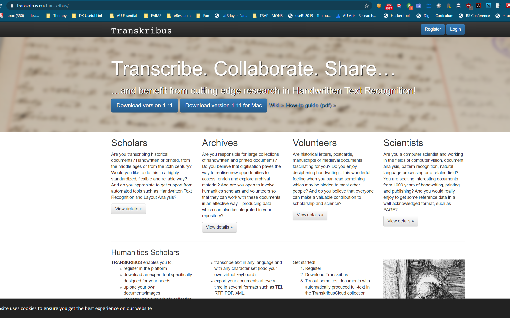

NEEDS PICTURES and FINAL PROOFREADING, otherwise fine.

```{r setup, include=FALSE}
knitr::opts_chunk$set(echo = TRUE)
```

# Getting Started

In order to proceed with the transcription of your case files during Wednesday in week 37, you will need to  set up Transkribus on your computer. This is a multiple-step process where you:

1. register for an account with https://Transkribus.eu, 
2. update your Java
3. download the Transkribus version suitable for your operating system
4. unzip and run Transkribus
5. OPTIONAL: obtain a model-training button (this can take up to a week and is done upon request only)

Please ensure to have completed all steps before Wednesday in week 37. If you need help, please alert course assistants by 10 am Friday in week 26


## Software and Prerequisites


- [JAVA](https://java.com/de/download/manual.jsp#win): Before downloading Transkribus, you will need to download the newest Java 8 if you don’t already have it. If you do have Java installed, you should still download and update your version, or at least [check it](https://java.com/en/download/help/version_manual.xml).  If you need an update, download the 64-bit offline version (recommended) for [Windows here](https://javadl.oracle.com/webapps/download/AutoDL?BundleId=242990_a4634525489241b9a9e1aa73d9e118e6), and for [Mac here](https://javadl.oracle.com/webapps/download/AutoDL?BundleId=242981_a4634525489241b9a9e1aa73d9e118e6). If you have difficulty getting the right Java, please sign up for the Help Desk.

- [TRANSKRIBUS](https://transkribus.eu/Transkribus) is a comprehensive platform for transcription and searching of historical hand-written documents, which facilitates - with large enough transcribed sample - the automated recognition of the documents. Note the download button directly under the page title, flanked 

## Installation

1. Go to https://Transkribus.eu and register. To register, you will need to provide your name, e-mail address, and accept the Transkribus user agreement. You can also log in using your Google account. Remember the credentials as you will need them to launch the software later. 




2. Download the correct version (for your OS) for free from the website. After download you should see a ZIP File in the download directory of your computer.

<!-- If the download fails - please download the latest release from here: [alternative download location](https://transkribus.eu/TranskribusX/releases/) -->

3.  Unzip the file and open the resulting Transkribus directory

4.  Start Transkribus by clicking an executable file :
- Windows:  use *Transkribus.exe*
- Mac OS - Apple: *Transkribus.command* - you may see this icon [TO BE ADDED]

5. Notes for the first launch

- Windows: If you do not have "Administrator" rights, Windows will produce a warning message, such as: "Your Computer is Protected by Windows", etc. Do not press "Confirm", but go to "More Information". There you can agree that Transkribus is not malware and that you want to run it on your computer.

- Mac: If you run the program the first time, it may not start because it is a non-signed application ("... can't be opened because it is from an unidentified developer" message).  In this case, right-click (or control-click) the application and choose "Open". In the appearing dialog box, click "Open" again! Alternatively, right-click the Track Pad to open the Context Menu and add a security exception for Transkribus.

If you encounter other problems and difficulties with installation: Have a look at Transkribus [FAQ page](https://transkribus.eu/wiki/index.php/Questions_and_Answers#Download_and_Installation) or sign up for our Help Desk.

# Learning to use Transkribus

Now you are ready to use Transkribus to handle historical documents. In order to produce meaningful digital transcriptions, you need to understand the concepts of text *segmentation* and *transcription* and learn how to apply them.

*Segmentation* is a process where you interpret potentially complex formatting of text on your page (e.g. tables, comments in the margins, stamps of various kinds, etc.), and divide it up into meaningful areas of text for transcription, later use and analysis. It is an interpretive step, that often requires forethought and consultation with colleagues.

*Transcription* is a process where you interpret the handwritten, machine-unreadable text and transcribe it into machine-readable format. As the main goal is to produce consistent and accurate transcripts quickly and efficiently (for training HTR models), conventions and guidelines govern transcription. You need to read about existing guidelines and agree on any additional ones relevant to your text with your research team.

Transkribus can do very powerful things, such as automated handwritten text recognition (HTR). We won't have time to delve into this capability in this workshop. Claus Juhl Knudsen and other colleagues from the Stadsarkivet, however, might have time to demonstrate.

## Segmenting and transcribing texts - Read and watch before class

*Video guides* for those who like videos.

1. Watch the following ['How-to' 4 minute video](https://youtu.be/8Ei0a7WIlTI), especially step 1-8, to learn how to use the Transkribus desktop software to transcribe and save documents.

2. Next, watch the [segmentation video](https://youtu.be/b0MqNwSIKC0) to learn how to parse complex page formatting in historical documents.

*Written instructions* for those who prefer reading at their own pace:

1. Segmentation and transcription are both covered in [How to use Transkribus - in 10 steps (or less) Guide](https://transkribus.eu/wiki/images/7/77/How_to_use_TRANSKRIBUS_-_10_steps.pdf) again focusing on steps 1-8 for a general overview of tools available.

*Everyone*: please consult the [Transcription Guidelines](https://transkribus.eu/wiki/images/3/31/Transkribus_Transcription_Conventions.pdf) to understand the know-how of transcription before you commence with your document. 

There are additional tips and tricks for special topics that apply to, for example, [Transcribing Tables](https://transkribus.eu/wiki/images/1/14/HowToProcessTables.pdf), should you run into these in the future (avoid transcribing tables in this course). 

## Saving transcriptions

https://transkribus.eu/wiki/images/b/bd/HowTo_Export_documents_from_Transkribus.pdf

# Your task
Your group will be allocated a folder number to download from the Shared Drive: ARTS_DigitalArchives2020\Transkribus. As part of this exercise each of you will transcribe one page from the archival sources. You will work with your group in breakout rooms in Zoom but also switch to plenary sessions to get guidance on any issues. You are strongly advised to obtain a mouse for this exercise.


1. Each person in your group should receive one unique page from your folder for segmentation and transcription
2. Document any decisions, and consult any problems/questions you have regarding segmentation and transcription in your group. Please use your group folder on the class GoogleDrive to record the group deliberations. 
3. As you progress, save your work and gather questions you wish to consult with instructors.
4. Consult your group issues in class and revise your transcriptions in light of the decisions
5. When finished, please export the transcription as a textfile (.txt). Transkribus should offer to export the file with the original filename. If it does not, please use the original filename when saving. 
6. Each group member should submit a minimum of one page of segmented and transcribed text to your group GoogleDrive space. Please avoid duplicates.


